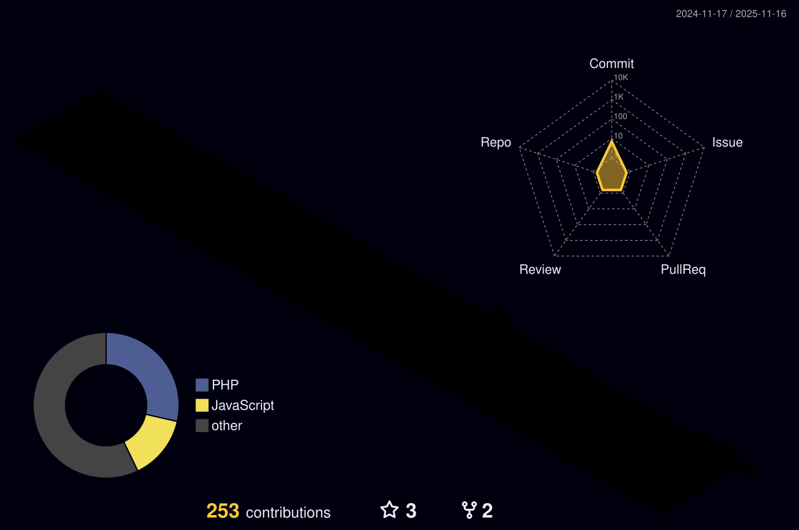

<h1 align="center" style="color: #8A2BE2">Wedgles Elinaldo da Silva</h1>

💻 Desenvolvedor Frontend | Focado em criar soluções eficientes e inovadoras

  
  

---

  
  <!--  -->
  
  

---
## 💻 Tech Stack & Ferramentas

---

  <i>“A tecnologia move o mundo, mas a curiosidade move o programador.”</i>

  

